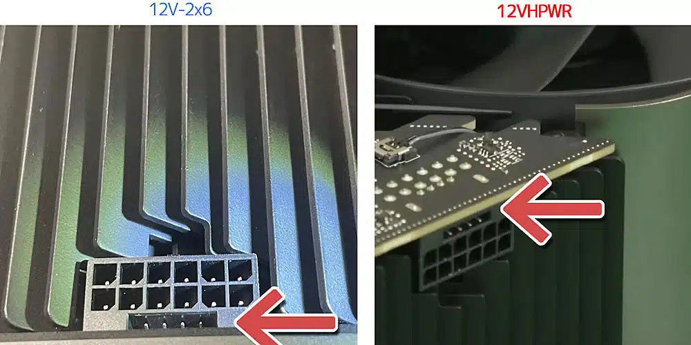
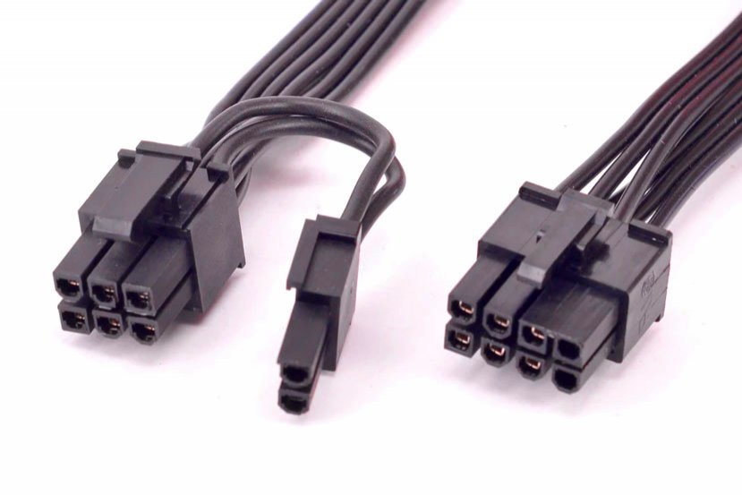
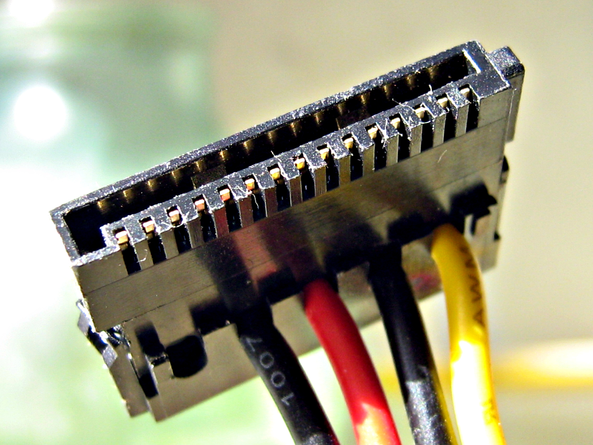
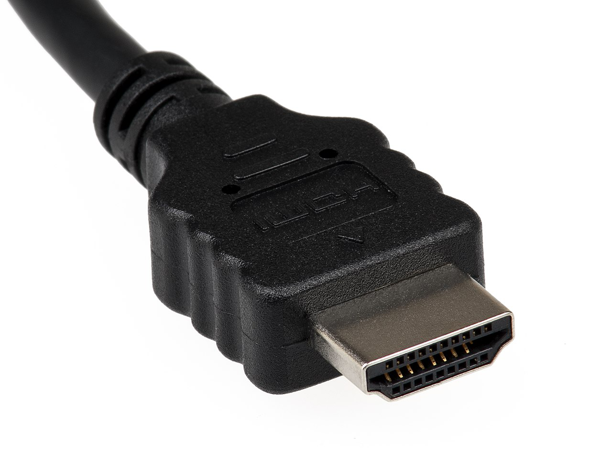
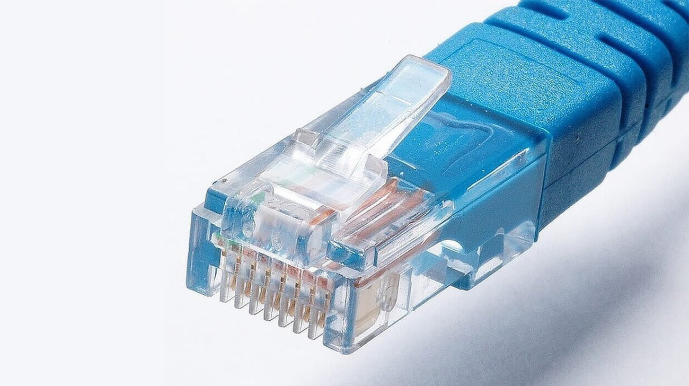
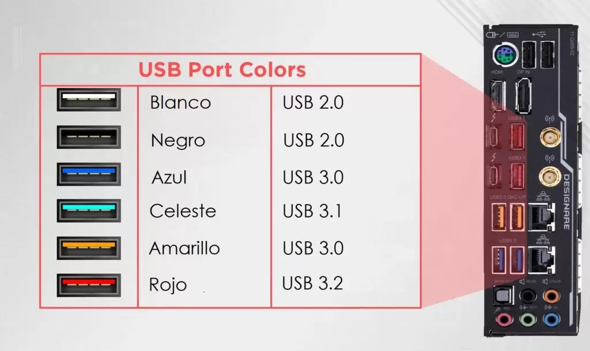
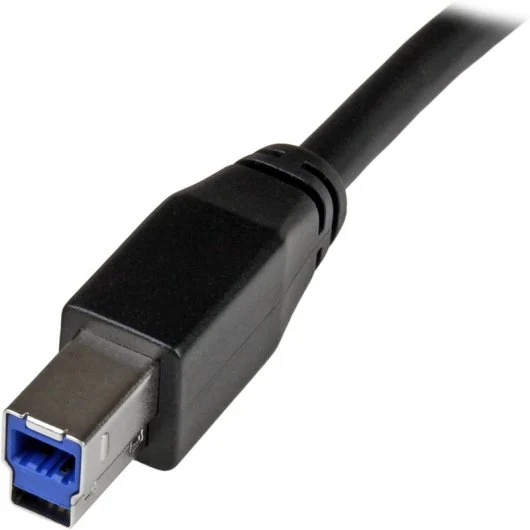
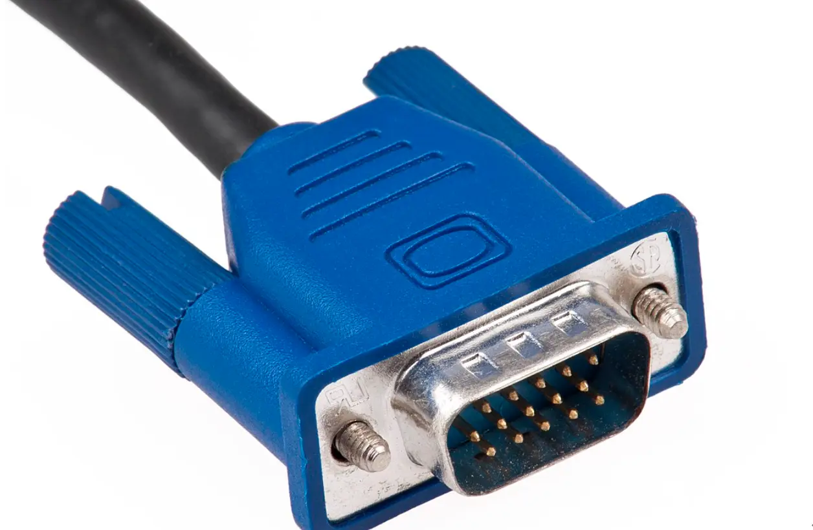

# ENTREGA ÚNICA - Reto 01

> Exporta este archivo como **PDF único** con nombre:  
> `apellido1_apellido2_nombre_FHW01_Tarea`  *(sin ñ ni tildes)*

## Índice

- [Portada](#portada)
- [1. Introducción](#1-introduccion)
- [2. Conectores internos (energía)](#2-conectores-internos-energia)
- [3. Conectores de datos](#3-conectores-de-datos)
- [4. Slots de expansión](#4-slots-de-expansion)
- [5. Conectores externos](#5-conectores-externos)
- [6. Bibliografía](#6-bibliografia)

## Portada
# Reto 1 — Investigación_Desarrollo_Conectores_Slots

**Módulo:** Fundamentos de Hardware (ASIR)  
**Alumno/a:** _Petar Georgiev Manev_  
**Curso:** 2025/26

## 1. Introducción
Piensa el PC como una **ciudad**:  
- **Conectores** = **carreteras y puentes** (energía y datos).  
- **Slots** = **parcelas** para ampliar (tarjetas).

Objetivo del reto: **identificar** y **explicar** conectores/slots **actuales** y, si procede, **legacy** aún en uso.

## 2. Conectores internos (energía)

# Conector: 12VHPWR 12+4 pins o  12V-2x6

**Descripción breve:** Conector principal que alimenta graficas de ultima generacion.  
**Pines/Carriles/Voltajes/Velocidad:** 12 + 4 pines o 2 de 6 pines,+12V, hasta 600W  
**Uso principal:** Alimentación de grafica  
**Compatibilidad actual:** Alta para: 12V-2x6 version PCIe 5.1

## Identificación física
- Bloque rectangular de 12 pines con clip.

## Notas técnicas
- Estándar 12VHPRW 2.0 version PCIe 5.0 obsoleto y reemplazado por 12V-2x6 para la version PCIe 5.1

## Fotos

## Fuentes
- [https://elchapuzasinformatico.com](https://elchapuzasinformatico.com/2023/09/conector-12v-2x6-vs-12vhpwr/)

# Conector: PEG(PCI Express Graphics) de 6p y 8p

**Descripción breve:** Diseñados para alimentar tarjetas gráficas dedicadas.   
**Pines/Carriles/Voltajes/Velocidad:** 6 o 8 pines,+12V, hasta 150W(6p) 300W(8p)   
**Uso principal:** Alimentación de graficas  
**Compatibilidad actual:** Alta

## Identificación física
- Bloque rectangular de 6 o 8 pines con clip.

## Notas técnicas
- No confudir con el conector de la CPU.
- Las fuentes de alimentacion antiguas suelen traer solo de 6 pines.

## Fotos

## Fuentes
- [https://www.geeknetic.es](https://www.geeknetic.es/Conector-PEG/que-es-y-para-que-sirve)

# Conector: ATX de 24 pines

**Descripción breve:** Conector principal que alimenta la placa base en sistemas ATX/ATX12V.   
**Pines/Carriles/Voltajes/Velocidad:** 24 pines · +3.3V, +5V, +12V  
**Uso principal:** Alimentación de la placa base  
**Compatibilidad actual:** Alta

## Identificación física
- Bloque rectangular de 24 pines con clip, situado en el borde de la placa base.

## Notas técnicas
- Estándar ATX12V 2.x. No confundir con el EPS de CPU (4/8 pines).

## Fotos

## Fuentes
- [https://www.profesionalreview.com](https://www.profesionalreview.com/2018/11/10/alimentacion-atx-24-pines-eps/)

# Conector: EPS 8 pines (4+4)

**Descripción breve:** Alimenta directamente a la CPU; se conecta cerca del socket.  
**Pines/Carriles/Voltajes/Velocidad:** 4 o 8 pines , +12V  
**Uso principal:** Alimentación de la CPU  
**Compatibilidad actual:** Alta

## Identificación física
- Bloque rectangular de 8 pines o dos de 4 pines con clip, situado al lado del socket de CPU en la placa base.

## Notas técnicas
- Estándar ATX12V tambien existe EPS12V que se diferencia en el pin 7
- Ambos son intercambiables, solo que EPS12 nunca viene en 4+4.

## Fotos

## Fuentes
- [https://www.reddit.com](https://www.reddit.com/r/buildapc/comments/6wez86/44pin_eps_vs_8_pin_eps/?tl=es-es)

# Conector: Molex

**Descripción breve:** Conector clásico utilizado para unidades IDE, ventiladores y otros periféricos.   
**Pines/Carriles/Voltajes/Velocidad:** 4 pines ·  +5V, +12V, hasta 134W.  
**Uso principal:** Alimentación de periféricos como ventiladores y unidades IDE  
**Compatibilidad actual:** Media (para antiguos equipos)

## Identificación física
- Bloque rectangular de 4 pines 

## Notas técnicas
- Guiarse por la forma para saber lado correcto.
- Hay machos y hembas.

## Fotos

## Fuentes
- [https://www.profesionalreview.com](https://www.profesionalreview.com/2019/12/31/conector-molex-todo-lo-que-necesitas-saber/)

# Conector: SATA Alimentacion

**Descripción breve:** Alimenta unidades de almacenamiento (HDD y SSD).   
**Pines/Carriles/Voltajes/Velocidad:** 15 pines · +3.3V, +5V, +12V,hasta 54W  
**Uso principal:** Alimentación de la disco duros HDD y SDD.  
**Compatibilidad actual:** Alta

## Identificación física
- Bloque rectangular de 15 pines en forma de L tumbada.

## Notas técnicas
- Importante guiarse de la forma para saber el lado de conexion correctos.

## Fotos

## Fuentes
- [https://ibericavip.com](https://ibericavip.com/blog/pc-workstation/guia-para-principiantes-sobre-cables-sata-todo-lo-que-necesitas-saber/)  

| Conector  | Número de pines  | Voltajes Suministrados  | Uso Principal  | Capacidad de Potencia  | Capacidad de Potencia  |
|:---:|:---:|:---:|:---:|:---:|:---:|
| 12VHPWR   | 12 + 4 pines o 2 de 6 pines  | +12 V | alimentacion de tarjetas graficas de ultima generacion  | hasta  600W | Alta  |
| ATX de 24 pines  | 24  | +3.3 V, +5 V, +12 V | Alimentación de la placa base  | Hasta 300 W  | Alta  |
| EPS de 4 y 8 pines  | 4 u 8  | +12 V  | Alimentación del procesador  | Hasta 150 W por conector  | Alta  |
| Molex  | 4 | +5 V, +12 V  | Alimentación de ventiladores y HDDs antiguos  | Hasta 132 W  | Media (para componentes antiguos)  |
| PEG de 6 y 8 pines  | 6 u 8  | +12 V  | Alimentación de tarjetas gráficas  | 75 W (6 pines), 150 W (8 pines)  | Alta  |
| SATA de alimentación  | 15  | +3.3 V, +5 V, +12 V  | Alimentación de HDDs y SSDs  | Hasta 54 W  | Alta  |

  

## 3. Conectores de datos

# Conector de datos: NVMe M.2 / SATA M.2 

**Descripción breve:** Interfaz de datos en serie para SATA y paralelelo para NVMe para conectar SSD.  
**Pines/Carriles/Voltajes/Velocidad:** Velocidad NVMe 5.0 PCIe hasta 15,76 GB/s /// SATA M.2 en version SATA III hasta 6GB/s 
**Uso principal:** Conexión de almacenamiento interno común  
**Compatibilidad actual:** Alta  

## Identificación física
- Conector plano , ranura con una muesca para NVMe M.2 o dos muescas para SATA M.2.

## Notas técnicas
- Ideal para edición de vídeo, videojuegos y usos que requieren alto rendimiento

## Fotos

## Fuentes
- [https://www.chuwi.com](https://www.chuwi.com/es/news/items/2834.html)
- [https://www.geeknetic.es](https://www.geeknetic.es/Guia/2189/SSD-M2-NVMe-y-SATA-Caracteristicas-y-Diferencias.html)

# Conector de datos: SAS (Serial Attached SCSI)

**Descripción breve:** Interfaz de datos en serie para conectar HDD/SSD/.  
**Pines/Carriles/Voltajes/Velocidad:** de 22 a 29 pines ·  (Conectores SFF-8482,SFF-8484) , SAS-4 22.5 Gbit/s 
**Uso principal:** Conexión de almacenamiento en servidores.  
**Compatibilidad actual:** Alta

## Identificación física
- Conector plano con muesca.

## Notas técnicas
- Hot-swap , alto rendimiento, velocidad ,fiabilidad y durabilidad.

## Fotos

## Fuentes
- [https://es.wikipedia.org](https://es.wikipedia.org/wiki/Serial_Attached_SCSI) 
- [https://blog.elhacker.net](https://blog.elhacker.net/2024/05/diferencias-unidades-disco-duro-sata-sas.html)

# Conector de datos: SATA (Serial ATA)

**Descripción breve:** Interfaz de datos en serie para conectar HDD/SSD/unidades ópticas.    
**Pines/Carriles/Voltajes/Velocidad:** 7 pines · 1.5/3/6 Gbps (SATA I/II/III)  
**Uso principal:** Conexión de almacenamiento interno común  
**Compatibilidad actual:** Alta

## Identificación física
- Conector plano en forma de L; cables delgados, longitud típica ≤1 m.

## Notas técnicas
- Hot-swap según controladora; no lleva alimentación (va por conector SATA power).

## Fotos

## Fuentes
-  [https://ibericavip.com/](https://ibericavip.com/blog/pc-workstation/guia-para-principiantes-sobre-cables-sata-todo-lo-que-necesitas-saber/)

# Conector de datos: interfaz U.2

**Descripción breve:** Interfaz de datos en para conectar HDD/SSD/   
**Pines/Carriles/Voltajes/Velocidad:** Hasta 5 GB/s 
**Uso principal:** Conexión de almacenamiento interno rara   
**Compatibilidad actual:** BAJA

## Identificación física
- Conector plano en forma de L; cables delgados, longitud típica ≤1 m.

## Notas técnicas
- Hot-swap según controladora; no lleva alimentación (va por conector SATA power).

## Fotos

## Fuentes
- [https://hardzone.es](https://hardzone.es/reportajes/que-es/interfaz-u-2-ssd/)
- [https://es.wikipedia.org](https://es.wikipedia.org/wiki/U.2)

## 4. Slots de expansión
# Slot: PCI Express x1 x4 x8 (Gen4/Gen5/Gen6)

**Descripción breve:** Ranura de expansión de altas prestaciones usada para GPUs/aceleradoras y otros componentes de ampliacion.    
**Pines/Carriles/Voltajes/Velocidad:** x1 x4 x8 carriles · x1 Gen4 1969MB/s Gen5 3.94 GB/s Gen6 7.56 GB/s  x4 Gen4 7876MB/s Gen5 15.75 GB/s Gen6 30.25 GB/s  x8 Gen4 15752MB/s Gen5 31.5 GB/s Gen6 60.5 GB/s
**Uso principal:** Tarjetas gráficas; también aceleradoras y NVMe en adaptador  
**Compatibilidad actual:** Alta

## Identificación física
- Ranura tamaño variable con pestaña; color variable por fabricante.
- Version 7.0 en desarollo con velocidades x1 15.125 GB/s , x2 31.52 GB/s , x4 60.50 GB/s , x8 121.00 GB/s.

## Notas técnicas
- Ancho de banda efectivo depende de generación y carriles disponibles (CPU/Chipset).

## Fotos

## Fuentes
- [https://ibericavip.com](https://ibericavip.com/blog/pc-workstation/todos-los-tipos-de-ranuras-pcie-explicados-y-comparados/)
- [https://www.profesionalreview.com](https://www.profesionalreview.com/2018/12/10/conectores-pci-express-x16-x8-x4-y-x1/)
- [https://www.geeknetic.es](https://www.geeknetic.es/Guia/2702/PCI-Express-Caracteristicas-y-Velocidad-de-Todas-sus-Versiones.html)
- [https://hardzone.es](https://hardzone.es/tutoriales/rendimiento/velocidad-pci-express-pcie/)

# Slot: PCI Express x16 (Gen4/Gen5/Gen6)

**Descripción breve:** Ranura de expansión de altas prestaciones usada para GPUs/aceleradoras.  
**Pines/Carriles/Voltajes/Velocidad:** x16 carriles · Gen4 16 GT/s · Gen5 32 GT/s  Gen6 121 GB/s 
**Uso principal:** Tarjetas gráficas; también aceleradoras y NVMe en adaptador  
**Compatibilidad actual:** Alta

## Identificación física
- Ranura larga con pestaña; color variable por fabricante.
- Version 7.0 en desarollo velocidade 242.00 GB/s

## Notas técnicas
- Ancho de banda efectivo depende de generación y carriles disponibles (CPU/Chipset).

## Fotos

## Fuentes
- [https://ibericavip.com](https://ibericavip.com/blog/pc-workstation/todos-los-tipos-de-ranuras-pcie-explicados-y-comparados/)
- [https://www.geeknetic.es](https://www.geeknetic.es/Guia/2702/PCI-Express-Caracteristicas-y-Velocidad-de-Todas-sus-Versiones.html)
- [https://hardzone.es](https://hardzone.es/tutoriales/rendimiento/velocidad-pci-express-pcie/)

# Slot: M.2 

**Descripción breve:** Ranura de expansión de altas prestaciones usada para SSD y tarjetas de red Wi-Fi y Bluetoth.    
**Pines/Carriles/Voltajes/Velocidad:** x2 o x4 carriles PCIe  · Gen4 3.94 GB/s a 7.88 GB/s  · Gen5 7.88 GB/s a 15.76 GB/s  · Gen6 15.125 GB/s a 31.52 GB/s  
**Uso principal:** Memoria SSD , Tarjetas de Red. 
**Compatibilidad actual:** Alta

## Identificación física
- Ranura pequeña ; color negro normalente.

## Notas técnicas
- Gen 7 en desarollo con velocidades de 31.52 GB/s a 60.50 GB/s .

## Fotos

## Fuentes
- [https://hardzone.es](https://hardzone.es/tutoriales/rendimiento/velocidad-pci-express-pcie/)
- [https://es.wikipedia.org](https://es.wikipedia.org/wiki/M.2)

## 5. Conectores externos
# Conector externo: DisplayPort 1.4-2.x

**Descripción breve:** interfaz digital moderna diseñada para transmitir tanto video como audio de alta calidad.  
**Pines/Carriles/Voltajes/Velocidad:**  1.4  8K a 60 Hz, 2.0 16k a 60Hz o 8k a 120Hz
**Uso principal:** común en monitores, ordenadores y tarjetas gráficas, especialmente en entornos profesionales y de gaming   
**Compatibilidad actual:** Alta

## Identificación física
- Ligeramente rectangular con un lado en ángulo (biselado), lo que evita conectarlo al revés.

## Notas técnicas
- Algunos cables incluyen un botón de presión para evitar desconexiones accidentales (no todos lo tienen).

## Fotos

## Fuentes
- [(https://en.wikipedia.org](https://en.wikipedia.org/wiki/DisplayPort)

# Conector externo: HDMI (High-Definition Multimedia Interface) 2.1/2.2

**Descripción breve:** Estándar para la transmisión de señales de video y audio de alta calidad.  
**Pines/Carriles/Voltajes/Velocidad:**  HDMI 2.1 48 Gbps 8K a 120 Hz 
HDMI 2.2 96 Gbps 12K a 120 Hz, o 4K a 480 fps 
**Uso principal:** Transmitir video y audio digital a monitores, televisores o proyectores.  
**Compatibilidad actual:** Alta

## Identificación física
- Forma  trapezoidal en la version A.

## Notas técnicas
- Dynamic HDR (mejora color/contraste por escena).
- VRR (Variable Refresh Rate) para juegos.
- QFT (Quick Frame Transport) y QMS (Quick Media Switching).

## Fotos

## Fuentes
-  [https://es.wikipedia.org](https://es.wikipedia.org/wiki/High-Definition_Multimedia_Interface)

# Conector externo: RJ-45 (ethernet)

**Descripción breve:** RJ-45 es un estándar para conexiones de red cableadas (Ethernet)  
**Pines/Carriles/Voltajes/Velocidad:** 8pines, 100Mbps , 1Gbps , 10Gbps  
**Uso principal:** Conectar el ordenador a redes locales o Internet. 
**Compatibilidad actual:** Alta 

## Identificación física
-  Rectangular, más ancho que el conector telefónico (RJ-11)

## Notas técnicas
- Pestaña de plástico que fija el conector y evita desconexiones.

## Fotos

## Fuentes
- [https://es.wikipedia.org](https://es.wikipedia.org/wiki/RJ-45)

# Conector externo: USB-A 

**Descripción breve:** Conector USB clásico, el más común en ordenadores y periféricos.  
**Pines/Carriles/Voltajes/Velocidad:** USB 3.0 0.5A , USB 3.1 0.9A , 5V 
**Uso principal:** Ratones, teclados, discos externos, memorias USB.   
**Compatibilidad actual:** Alta 

## Identificación física
- Forma rectangular.

## Notas técnicas
- Hay diferentes versiones con diferentes colores dependiendo del fabricante.

## Fotos

## Fuentes
- [https://usb.org/](https://usb.org/)
- [https://www.profesionalreview.com](https://www.profesionalreview.com/2022/10/09/voltaje-usb/)
- [https://www.reparacion-ordenadores.com](https://www.reparacion-ordenadores.com/que-significan-los-colores-en-los-puertos-usb-de-un-pc/)

# Conector externo: USB-B 

**Descripción breve:** Menos común en dispositivos personales; típico en equipos más grandes.  
**Pines/Carriles/Voltajes/Velocidad:** 5V , 0.5a  
**Uso principal:** Impresoras, escáneres, dispositivos industriales  
**Compatibilidad actual:** Media

## Identificación física
- Menos común en dispositivos personales; típico en equipos más grandes.

## Notas técnicas
- Variante USB 3.0: Versión Tipo B con extensión adicional (más alta) e interior azul.

## Fotos

## Fuentes
- [https://usb.org/](https://usb.org)
- [https://www.geeknetic.es](https://www.geeknetic.es/USB-B/que-es-y-para-que-sirve)

# Conector externo: USB-C (USB4/PD)

**Descripción breve:** Conector reversible para datos, vídeo y alimentación (PD).  
**Pines/Carriles/Voltajes/Velocidad:** 24 pines · USB4 hasta 40 Gbps · PD hasta 100–240 W (según perfil)  
**Uso principal:** Carga y conexión de periféricos/monitores/docks  
**Compatibilidad actual:** Alta (ojo: no todo USB-C soporta TB/PD)

## Identificación física
- Ovalado y simétrico; símbolos: rayo (Thunderbolt), “SS” (SuperSpeed).

## Notas técnicas
- Requisitos de cable para 40 Gbps/240 W; DP Alt Mode para vídeo si no es TB.

## Fotos

## Fuentes
- [https://usb.org/](https://usb.org)
- [https://www.xataka.com/](https://www.xataka.com/basics/usb-type-c-que-exactamente-que-se-diferencia-resto)

# Conector externo: VGA Video Graphics Array

**Descripción breve:** interfaz analogica de video.  
**Pines/Carriles/Voltajes/Velocidad:** señal analogica, Hasta 2048 × 1536 
**Uso principal:** Monitores, proyectores, televisores antiguos   
**Compatibilidad actual:** Media (Equipos antiguos)

## Identificación física
- Trapezoidal, 15 pines en 3 filas, Azul generalmente

## Notas técnicas
- VGA es conocido como un "arreglo" en lugar de un "adaptador".

## Fotos

## Fuentes
- [https://en.wikipedia.org](https://es.wikipedia.org/wiki/Video_Graphics_Array)

## 6. Bibliografía
- 12VHPWR 12+4 pins o  12V-2x6: [https://elchapuzasinformatico.com](https://elchapuzasinformatico.com/2023/09/conector-12v-2x6-vs-12vhpwr/)
- PEG [https://www.geeknetic.es](https://www.geeknetic.es/Conector-PEG/que-es-y-para-que-sirve)
- ATX de 24 pines [https://www.profesionalreview.com](https://www.profesionalreview.com/2018/11/10/alimentacion-atx-24-pines-eps/)
- EPS 8 pines (4+4) [https://www.reddit.com](https://www.reddit.com/r/buildapc/comments/6wez86/44pin_eps_vs_8_pin_eps/?tl=es-es)
- Molex [https://www.profesionalreview.com](https://www.profesionalreview.com/2019/12/31/conector-molex-todo-lo-que-necesitas-saber/)
- SATA Alimentacion [https://ibericavip.com](https://ibericavip.com/blog/pc-workstation/guia-para-principiantes-sobre-cables-sata-todo-lo-que-necesitas-saber/)
- NVMe M.2 / SATA M.2  [https://www.chuwi.com](https://www.chuwi.com/es/news/items/2834.html), [https://www.geeknetic.es](https://www.geeknetic.es/Guia/2189/SSD-M2-NVMe-y-SATA-Caracteristicas-y-Diferencias.html)
- SAS (Serial Attached SCSI) [https://es.wikipedia.org](https://es.wikipedia.org/wiki/Serial_Attached_SCSI), [https://blog.elhacker.net](https://blog.elhacker.net/2024/05/diferencias-unidades-disco-duro-sata-sas.html)
- SATA (Serial ATA) [https://ibericavip.com/](https://ibericavip.com/blog/pc-workstation/guia-para-principiantes-sobre-cables-sata-todo-lo-que-necesitas-saber/)
- U.2 [https://hardzone.es](https://hardzone.es/reportajes/que-es/interfaz-u-2-ssd/), [https://es.wikipedia.org](https://es.wikipedia.org/wiki/U.2)
- PCI Express x1 x4 x8 x16  [https://ibericavip.com](https://ibericavip.com/blog/pc-workstation/todos-los-tipos-de-ranuras-pcie-explicados-y-comparados/), [https://www.profesionalreview.com](https://www.profesionalreview.com/2018/12/10/conectores-pci-express-x16-x8-x4-y-x1/), [https://www.geeknetic.es](https://www.geeknetic.es/Guia/2702/PCI-Express-Caracteristicas-y-Velocidad-de-Todas-sus-Versiones.html), [https://hardzone.es](https://hardzone.es/tutoriales/rendimiento/velocidad-pci-express-pcie/)
- Slot: M.2 [https://hardzone.es](https://hardzone.es/tutoriales/rendimiento/velocidad-pci-express-pcie/), [https://es.wikipedia.org](https://es.wikipedia.org/wiki/M.2)
- DisplayPort [(https://en.wikipedia.org](https://en.wikipedia.org/wiki/DisplayPort)
- HDMI [https://es.wikipedia.org](https://es.wikipedia.org/wiki/High-Definition_Multimedia_Interface)
- RJ-45 [https://es.wikipedia.org](https://es.wikipedia.org/wiki/RJ-45)
- USB-A [https://usb.org/](https://usb.org/), [https://www.profesionalreview.com](https://www.profesionalreview.com/2022/10/09/voltaje-usb/)
- USB-B [https://www.reparacion-ordenadores.com](https://www.reparacion-ordenadores.com/que-significan-los-colores-en-los-puertos-usb-de-un-pc/), 
[https://www.geeknetic.es](https://www.geeknetic.es/USB-B/que-es-y-para-que-sirve)
- USB-C [https://usb.org/](https://usb.org), [https://www.xataka.com/](https://www.xataka.com/basics/usb-type-c-que-exactamente-que-se-diferencia-resto)
- VGA Video Graphics Array [https://en.wikipedia.org](https://es.wikipedia.org/wiki/Video_Graphics_Array)

